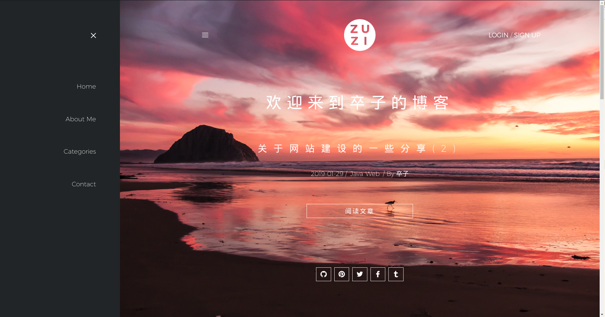

# ZUZI的个人网站-前端(https://www.guohezuzi.cn)
## 构建
1.安装依赖

`npm intall`

2.运行(端口9000)

`npm run dev`

## 特征
- 基于[vue](https://github.com/vuejs/vue) [vuex](https://github.com/vuejs/vuex) [vue-router](https://github.com/vuejs/vue-router) 构建
- vw/vh做响应式
- flex布局

## 截图

## Listen
